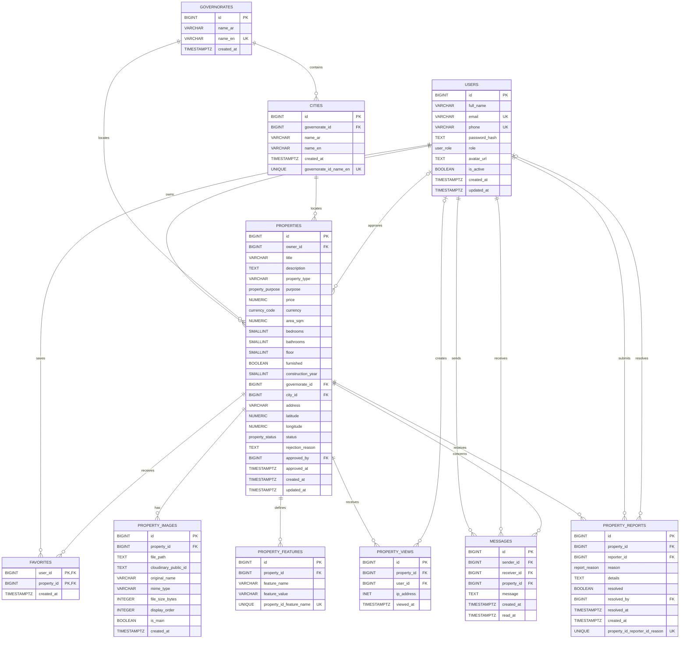

# Maskank Database UML

This diagram represents the current database structure defined in
[`schema.sql`](./schema.sql). Historical migrations that add and later remove
property contact fields are not represented because `contact_phone` and
`whatsapp_phone` are no longer part of the active schema.

## Relationship and deletion rules

- Deleting a governorate is restricted while cities or properties reference it.
- Deleting a city is restricted while properties reference it.
- Deleting a property cascades to its images, features, favorites, views,
  messages, and reports.
- Deleting a user cascades to favorites and reports submitted by that user.
- A deleted user remains referenced as `NULL` for optional property views,
  approved properties, and report resolutions.
- Messages require different sender and receiver users.
- A property can have at most one image marked as the main image.
- A property's latitude and longitude are either both present or both absent.

## PostgreSQL enum types

- `user_role`: `USER`, `OWNER`, `BROKER`, `ADMIN`
- `property_purpose`: `sale`, `rent`
- `property_status`: `pending`, `approved`, `rejected`, `sold`, `rented`
- `currency_code`: `EGP`
- `report_reason`: `fake_property`, `incorrect_information`,
  `wrong_price`, `duplicate_listing`, `inappropriate_content`, `other`
